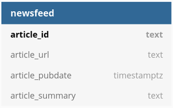

## Spaceflight News Retrieval

### Overview
The goal of this project is to retrieve links to the latest space flight news 
articles from the [Spaceflight News API](www.spaceflightnewsapi.net) and write 
it to a PostgreSQL database.

### Getting started

To get the environment running on your system, go through the following steps:

1. Clone the repository into the working directory and move into the project 
   directory:
   ```
   git clone https://github.com/bastiaanhoeben/spaceflight-news
   ```
   ```
   cd spaceflight-news
   ```
   
2. Start up the database service in the background and build the python 
   application:
   ```
   docker-compose up -d
   ```

3. Run the python application and follow the instructions prompted for:
   ```
   docker-compose run app main.py
   ```

### Data format

The data retrieved from the Spaceflight News API is saved in the PostgreSQL 
database in the following table format:


